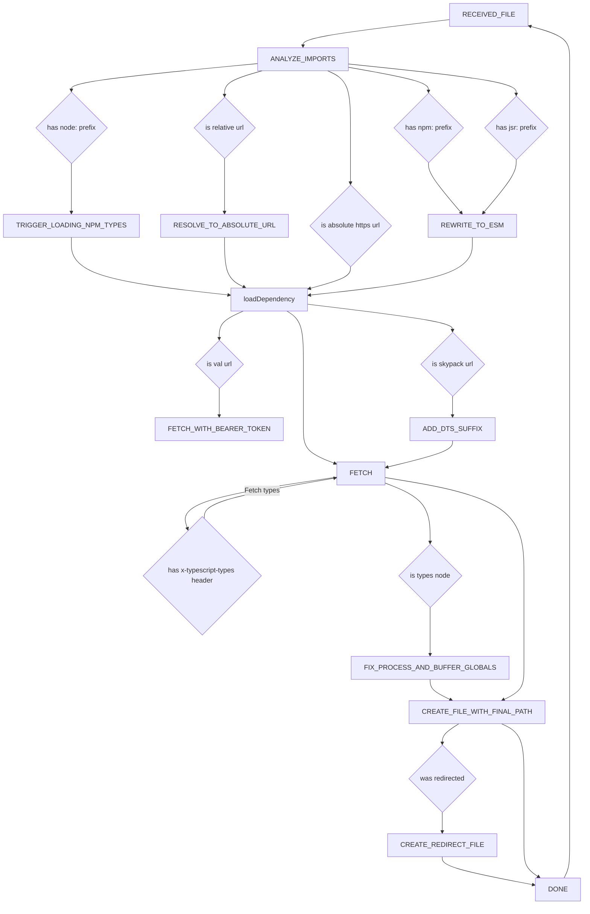

# ATA

This was originally based on [Automatic Type Acquisition](https://github.com/microsoft/TypeScript-Website/tree/v2/packages/ata), a subproject
of TypeScript-Website, which powers the TypeScript Playground. What ATA
does is it loads TypeScript types from jsDelivr and figures out `@types/` packages
for imported NPM modules.

When someone types

```ts
import chalk from "npm:chalk";
```

We want to provide them with nice types. That's the intent here.

## Differences from ATA

This is now dramatically different from ATA because Deno is dramatically
different from Node. Here are some of the differences:

- Deno relies heavily on URL (HTTP) imports. TypeScript does not support them at all:
  <https://github.com/microsoft/TypeScript/issues/35749>
- Deno references NPM modules using a `npm:` prefix. TypeScript does not support
  that at all. It also supports a `jsr:` prefix for JSR imports. TypeScript does not
  support that at all.
- Deno requires Node modules be imported using the `node:` prefix. TypeScript does
  not make it easy to add that requirement.

Supporting URL imports, the `npm:` and `jsr:` prefixes, the required `node:` prefix,
is very difficult.

## Alternative paths

Deno has a [Deno Language Server](https://github.com/denoland/deno/tree/main/cli/lsp)
which implements all of its workarounds. Unfortunately, it's both written in Rust
and relies on Deno itself. Using it on the frontend would be a total nonstarter - even
if we were to compile it to WASM, it would be tens of megabytes.

We could run the Deno LSP on a server. This would require us to manage a lot of
extra, sandboxed servers.

## Workflow

Reflects reality on June 13, 2024.


